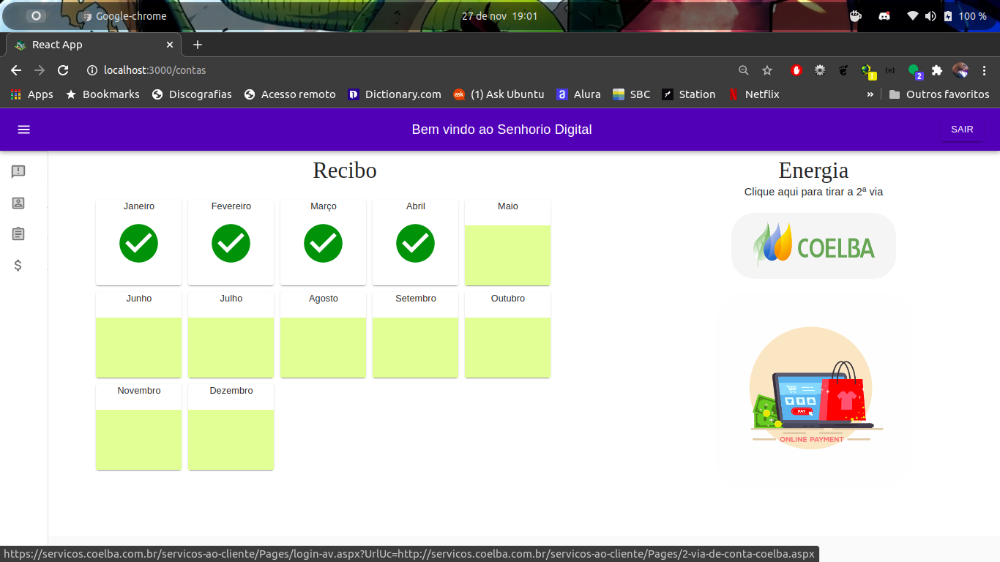

<h1 align="center" font-size="35px">Senhorio Digital</h1>

Devido a pandemia do Covid-19, efetuar transações físicas se torna letal principalmente quando ídosos, pessoas com obesidade ou pessoas do grupo de risco em geral tem que participar desse contato. No nosso caso trata-se de um gerenciamento de inquilinos em casas de aluguel, onde para cada inquilino é necessário ter um contrato de aluguel, contas de energia e o pagamento da mensalidade da casa. Com todas essas informações foi identificado que dá para automátizar o processo tornando as ações digitais, trazendo mais segurança para ambas as partes.

<h2 align="left">Tecnologias utilizadas</h2>

- React 17.0.1
- API Firebase 8.0.2
- Material-UI
- React-router-dom

Para iniciar o projeto clone o repositorio no seu terminal com o comando 'git clone https://github.com/Beninigmal/Senhorio-Digital.git', e após isso digite 'npm install' na pasta onde foi clonada para que as dependencias sejam baixadas, para executar no https://localhost:3000 digite o comando 'npm start'.

<h2 align="center">Sobre a aplicação</h2>

Ao primeiro acesso a aplicação web, é necessário uma autenticão por e-mail, portanto o usuário deverá ter um cadastro

Logo após efetuado o cadastro/login a tela de informações é carregada com algumas informações como comunicados

A próxima tela para seguir um fluxo seria a do contrato, nela é observador que os campos com as informações do inquilino se mostram com uma cor destacada e ao clicar um \"snackbar"\ aparece solicitando que o cadastro seja feito na tela de cadastro.

Agora voltando para a tela de contrato podemos observar que os locais estão preenchidos com os dados cadastrados desaparecendo com os destaques anteriores.

  

A próxima tela mostra a parte relacionado as contas onde é mostrado os meses contratados,onde os meses a pagar estão em verde musgo e os meses pagos estão com um ícone de sucesso, demonstrando que aquele mês foi pago, junto a isso tem a área de 2ª via de contas de energia, de forma que será redirecionado em nova aba para o site da Coelba

  

<h2 align="center">Status do projeto</h2>

O projeto está ainda em fase inicial de desenvolvimento, sendo necessário criar muitas features, incluíndo a vísão do senhorio e uma visão de ADM, assim como outras funções como organizador de comprovantes de pagamentos de contas de energia, área de comunicação com o senhorio, hover para cada mês pago com recibo digital, entre outras coisas, que depende de conhecimentos especificos para serem aplicadas.

<h2 align="center">Talent Sprint</h2>

 Esse projeto foi desenvolvido para o Talent Sprint Solutis em aproximadamente duas semanas, onde particularmente me sinto muito bem com a quantidade de conteúdo absorvido, com cada bug resolvido, e com o apoio principalmente dos colegas do treinamento React que são feras!

